# Team-Quaternary_OPSC7312

# Bot Lobby: Esports Team Manager

## Team Members
Team Quaternary:
ST10019838 - Damian Dare
ST10019972 - Guillaume Swanevelder
ST10091991 - Christiaan Versfeld
ST10158660 - Ruan Zwarts


## Project Overview
Bot Lobby is a mobile application designed for esports teams and players. It facilitates team creation, player scouting, event management, and personalised profile settings, fostering community interaction within the esports ecosystem.

This mobile application targets the esports gaming community, enabling users to join teams, search for teams, and connect with other gamers who share their interests. The app will feature a three-model design consisting of client, API, and database services, each using custom data structures for specialised operations. We aim to include secure login functionality, team and user management, team and user searching functionality, integrative calendars, localisation, and accessibility settings like dark mode and language support.

### Key Features
- **Profile Customisation**: Players can customise their profile with a gamer tag, profile picture, and more.
- **Team Management**: Create and manage teams, assign roles, and schedule events.
- **Scouting**: Discover and invite players to join teams or search for teams to join.
- **Event Calendar**: Manage team events with notifications and scheduling features.
- **Biometric Login**: Secure login using biometric authentication.
- **Push Notifications**: Stay updated with real-time event notifications.
- **Localisation & Accessibility**: Supports multiple languages, including two South African languages, and a dark mode feature.

### Our Objectives for the Application:
- To implement custom data structures for flexible data access.
- To ensure secure data retrieval using a three-model design to access data via an API rather than directly from the database.
- To enable team management with role-based permissions.
- To build an application that will aid in creating a sense of community where users can find and interact with other users who share their love for gaming.

### Innovative Features:
- **Profile Customisation**: Users can customize their personal profile by adding, updating, or removing user-specific data, such as a profile picture, gamer tag, profile description, and "Looking for Team" status.
- **Team Management**: Team owners/coaches can manage team members based on roles, including adding, updating, and removing members. Furthermore, team owners/coaches can schedule events for the team, like recurring practices or match days.
- **Event Calendar**: Team members can view the events scheduled for their teams by interacting with the event calendar. Users can select a day from this calendar, and all their events for that day will be shown.  This is targeted in a future release. 
- **Team Performance Tracking**: Team coaches can monitor and assess each of the team member’s contributions and commitment to the team by tracking their event attendance and participation.
- **Biometric Login and Registration**: To add an extra layer of security to the application, biometric authentication will be used.  This is targeted in a future release. 
- **Looking for Team (LFT)**: Players can search for open teams based on their preferred games using the in-app scouting feature.
- **Looking for Members (LFM)**: Team owners/coaches can search for players to fill their teams using the in-app scouting feature.
- **Localization and Accessibility**: Users can personalize their app settings, including dark mode and language preferences.
- **Real-Time Push Notifications**: The application will inform users of event-specific updates and announcements from their teams using push notifications.

## Installation
Clone this repository and import it into Android Studio. Ensure that the required SDKs and Kotlin plugin are installed.

```bash
git clone https://github.com/ST10019838/Team-Quaternary_OPSC7312.git
```

## User Defined Features

- **Teams**: Users can create teams for themselves
- **Scouting - Players**: Users can search for players
- **Scouting - Teams**: Users can search for players
- **Profile**: Users can edit and configure their profile


## Usage
- **Register/Login**: Securely create an account or log in using biometrics.
- **Manage Teams**: Create teams, assign roles, and manage team members.
- **Profile**: Customise user profile and allow for application settings changes.
- **Event Management**: Schedule events using the calendar and send notifications.
- **Scouting**: Explore open teams and players using the scouting feature.

## Demonstration
Watch the [YouTube demonstration](https://www.youtube.com/mockup-link) to see Bot Lobby in action.

## Automated Testing
The project uses **GitHub Actions** for continuous integration and automated testing. Tests ensure the app's functionality across different environments and devices.

To set up automated testing with GitHub Actions:
- Follow this [GitHub Actions guide](https://github.com/marketplace/actions/automated-build-android-app-with-github-action).
- Reference the example `.yml` file [here](https://github.com/IMAD5112/Github-actions/blob/main/.github/workflows/build.yml).

```yaml
name: Android CI

on:
  push:
    branches:
      - main
  pull_request:
    branches:
      - main

jobs:
  build:
    runs-on: windows-latest  # Uses GitHub's Windows Server 2022 environment

    steps:
    - name: Checkout code
      uses: actions/checkout@v2

    - name: Set up JDK
      uses: actions/setup-java@v1
      with:
        java-version: '11'

    - name: Build with Gradle
      run: ./gradlew build
```

## Design Considerations
Bot Lobby is built around efficient team and player management using custom data structures. Its architecture utilises a **REST API** for handling CRUD operations on users, teams, and events, ensuring scalability and security.

## Contributors
### Team-Quaternary_OPSC7312
- **ST10019838** - Damian Dare
- **ST10019972** - Guillaume Swanevelder
- **ST10091991** - Christiaan Versfeld
- **ST10158660** - Ruan Zwarts

## Images
Here are images of key screens:

1. **Login Screen**  
   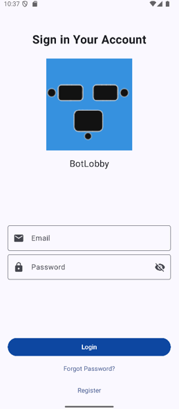

2. **Registration Screen**  
   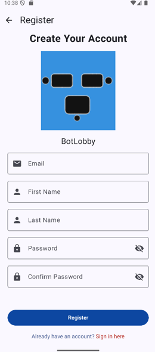

3. **Forgot Password**  
   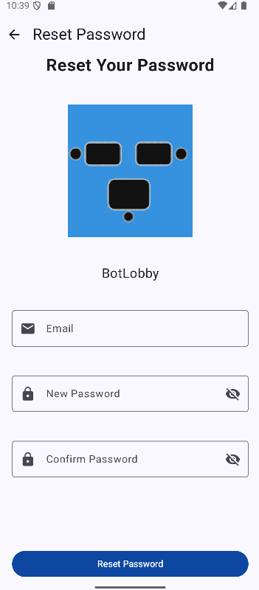

4. **Home Screen**  
   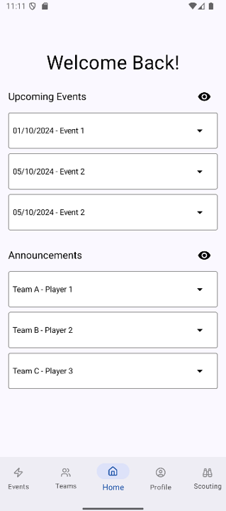

5. **Player Profile**  
   <p>
   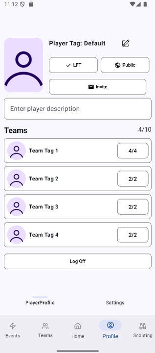
   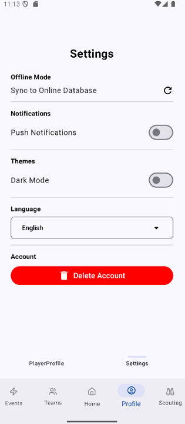
   </p>

6. **Team Management**  
   <p>
   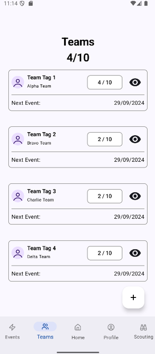
   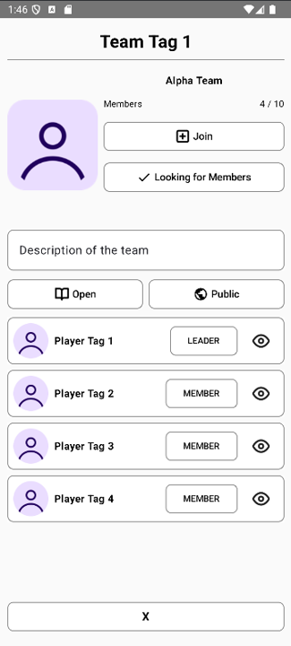
   </p>

7. **Event Calendar**  
   <p>
   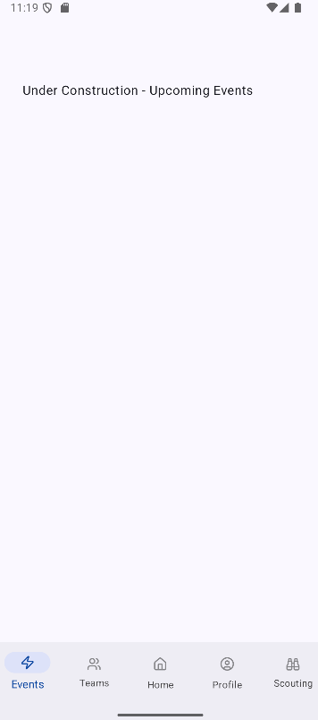
   </p>

8. **Scouting**  
   <p>
   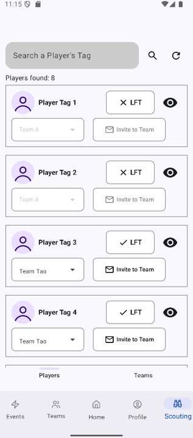
   
   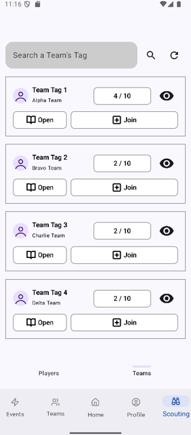
   
   </p>

### Dependencies
Below is a list of dependencies used in the project:

- **Kotlin**:
  - `org.jetbrains.kotlin:kotlin-stdlib`
- **AndroidX**:
  - `androidx.core:core-ktx`
  - `androidx.lifecycle:lifecycle-runtime-ktx`
  - `androidx.lifecycle:lifecycle-viewmodel-ktx`
  - `androidx.navigation:navigation-fragment-ktx`
  - `androidx.navigation:navigation-ui-ktx`
- **Firebase**:
  - `com.google.firebase:firebase-auth`
  - `com.google.firebase:firebase-analytics`
- **Google Play Services**:
  - `com.google.android.gms:play-services-auth`
  - `com.google.android.gms:play-services-identity`
  - `com.google.android.gms:play-services-safetynet`
- **Networking**:
  - `com.squareup.retrofit2:retrofit`
  - `com.squareup.retrofit2:converter-gson`
  - `com.squareup.okhttp3:okhttp`
- **UI & Material Design**:
  - `com.google.android.material:material`
  - `androidx.compose.ui:ui-tooling`
- **Testing**:
  - `junit:junit`
  - `androidx.test.ext:junit`
  - `androidx.test.espresso:espresso-core`
